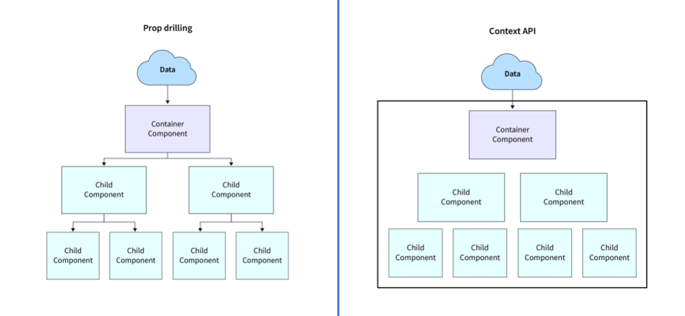

# What is ReactJS ?
🔹 ReactJS is a JavaScript library renowned for simplifying the creation of dynamic user interfaces. Its significance in 2024 stems from its foundational role in modern web development. React's virtual DOM optimizes rendering, enhancing performance crucial for today's demanding web applications. Its component-based architecture promotes modular and reusable code, facilitating collaborative development and scalability.

🔸 In 2024, React's ecosystem remains vibrant, with extensive documentation, libraries, and community support, accelerating development and innovation. Its state management solutions, such as Redux and Context API, streamline data handling in complex applications, ensuring maintainability and efficiency.

🔹 Moreover, React's support for server-side rendering enhances search engine optimization (SEO) and initial load times, aligning with the industry's emphasis on performance and accessibility.

🔸 Overall, React.js empowers developers to craft responsive, scalable applications efficiently, addressing the evolving needs of the digital landscape in 2024. Its widespread adoption and continuous evolution solidify its position as a cornerstone technology in modern web development.


## What is Vite?
🔹 Vite is a modern build tool for web development, known for its fast development server and quick startup times.

🔸 It supports various frameworks like React, Vue, and others, offering a streamlined development experience with features like hot module replacement. Ideal for rapid prototyping and building performant web applications.


## What is Components?
🔹 React Components are the building block of React Application. They are the reusable code blocks containing logic and UI elements.

🔸 Components can be anything from a simple button or input field to complex elements like a navigation bar or a modal window.

🔹 Components in React follow a tree-like structure, where smaller components can be combined to build larger ones. This compositional nature makes React highly modular, promoting code reusability and maintainability.


## What is Props?
🔸 Props is a special keyword in React that stands for properties and is used for passing data from one component to another.

🔹 Data with props are passed in a unidirectional flow from parent to child.

🔸 Props data is read-only, which means that data coming from the parent shouldn’t be changed by child components.


## What is React List?
🔹 React's list component efficiently renders dynamic data arrays, updating the UI as needed. It simplifies managing dynamic content by mapping data to components, enhancing performance and scalability.

🔸 With React, developers can easily manipulate and update lists, creating responsive and modular user interfaces for web applications.

🔹 The JavaScript map() array method is generally the preferred method to traverse a list.


## What is map()?
🔸 The map() method in JavaScript creates a new array by applying a function to each element of the original array.

🔹 It skips empty elements and does not alter the original array, making it ideal for transforming data.


## What is Keys?
🔸 Keys are an important aspect of rendering lists in React. Keys allow React to keep track of elements. This way, if an item is updated or removed, only that item will be re-rendered instead of the entire list.

🔹 Keys need to be unique to each sibling. But they can be duplicated globally.


## What are React Hooks?
🔸 React Hooks revolutionized React development by allowing functional components to manage state and lifecycle methods. They eliminate the need for class components, simplifying code and making it more readable and maintainable.

🔹 With Hooks, developers can encapsulate logic and reuse it across components, promoting cleaner and more modular code. Hooks also enhance performance by reducing unnecessary re-renders. They enable developers to share logic between components easily, improving code organization and promoting best practices.

🔸 Overall, React Hooks significantly improves developer productivity, code quality, and scalability, making React development more efficient and enjoyable.


## Explain React Hook rules?
There are 3 rules for react hooks:
- Hooks can only be called inside React function components.
- Hooks can only be called at the top level of a component.
- Hooks cannot be conditional.


## What is useState() Hook?
🔸 The `useState()` hook in React allows functional components to manage state. It returns a stateful value and a function to update it.

🔹 This hook simplifies state management by eliminating the need for class components, making it easier to handle component state within functional components.


## What is useEffect() Hook?
🔸 The `useEffect()` in ReactJS is used to handle the side effects such as fetching data and updating DOM.

🔹 This hook runs on every render but there is also a way of using a dependency array using which we can control the effect of rendering.

### useEffect() Syntax
```sh
useEffect(() => {
        Side Effect code that want to run
    return () => {
        Optional Return Function -> Cleanup Function
    }
 }, []) // The Dependency Array
```

1. No Dependency Array
```sh
useEffect(() => {
  // Runs on every render
});
```

2. An Empty Dependency Array
```sh
useEffect(() => {
  // Runs only on the first render
}, []);
```

3. With Dependency Array
```sh
useEffect(() => {
  // Runs on the first render
  // And any time any dependency value changes
}, [prop, state]);
```

## What is useRef() Hook?
🔸 The `useRef()` is a React Hook used to create a mutable reference that persists across renders. It returns a mutable object with a `.current` property, which can hold any value.

🔹 Unlike state, changing the `.current` property doesn't trigger a re-render.

🔸 It's commonly used to store and access values that need to persist between renders, such as accessing DOM elements imperatively, managing previous state values, or caching values across renders.

🔹 Additionally, it's useful for accessing and modifying values within event handlers or effects without triggering re-renders.


## What is useContext() Hook?
🔸 The `useContext()` is a React Hook used to consume context provided by a `Context.Provider` component.

🔹 It allows functional components to access values from a context object without manually passing props down through each level of the component tree.

🔸 By calling `useContext(MyContext)`, it retrieves the current context value for `MyContext`.

🔹 When the context value updates, components using `useContext()` will re-render to reflect the most recent context value.

🔸 This simplifies state management and avoids prop drilling, making it easier to share data across components that need it.




## What is useMemo() Hook?
🔹 The `useMemo()` is a React hook used for memoizing expensive calculations so they are not recomputed on every render. It takes a function and an array of dependencies.

🔸 When any dependency changes, the function re-runs, returning a cached result if dependencies haven't changed.

🔹 This optimization can improve performance by avoiding unnecessary recalculations, making it ideal for optimizing components that rely on computationally expensive logic or data processing.


## What is useCallback() Hook?
🔸 The `useCallback()` is a React hook that memoizes a callback function, returning a memoized version that only changes if its dependencies change.

🔹 This optimization is useful for performance, preventing unnecessary re-renders of child components that rely on callback props.

🔸 It's particularly beneficial when passing callbacks to optimized child components or using in `useEffect()` to optimize event handlers or subscriptions.

🔹 Usage involves specifying dependencies in an array; changes in these dependencies trigger the creation of a new callback or reuse of the existing one. 

🔸 Thus, `useCallback()` enhances efficiency by maintaining stable references to functions across renders, improving overall application performance.